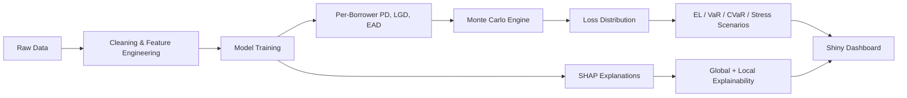

# Credit Risk Prediction using Monte Carlo Simulation & Explainable AI

An end-to-end, production-style credit risk engine in R, combining gradient-boosted default prediction, correlated-default Monte Carlo simulation for portfolio loss, and SHAP-based explainability, wrapped in a reproducible pipeline and an interactive Shiny dashboard.

## Design Philosophy

- Full loss distribution via Monte Carlo, with correlated defaults (not independent Bernoulli trials, real portfolios fail together in downturns)
- XGBoost benchmarked against Logistic Regression + WOE/Scorecard, so you always have an interpretable fallback
- SHAP (global + local) mapped to individual adverse-action-style explanations, the kind you could hand to a regulator or a rejected applicant
- `targets`-orchestrated pipeline, fully reproducible, caches intermediate steps, re-runs only what changed
- Interactive Shiny dashboard, explore borrower-level explanations and portfolio stress scenarios live

## Dataset

This project uses the [Lending Club Dataset](https://www.kaggle.com/datasets/wordsforthewise/lending-club), real peer-to-peer loan data spanning 2007 through recent years, with ~150 features per loan including FICO scores, income, debt-to-income ratio, credit history, and loan performance.

### Why this dataset

- Real, feature-rich borrower data
- Large enough for portfolio-level Monte Carlo simulation
- Defensible risk-metric proxies

### Only the accepted-loans file is used

The dataset also ships a separate rejected applications file, which is intentionally not used here. Rejected applicants were never funded, so there's no repayment outcome to observe, no loan status, no LGD, no EAD. Since this project models risk on an already-funded portfolio, rejected applications have nothing to contribute.

### Sample restricted to matured loans

Only loans with a final `loan_status` of `Fully Paid` or `Charged Off` are kept. Including other loan statuses would introduce censored, uninformative labels and bias the PD model. This also means older loan vintages are preferred over newer ones: a matured loan gives an honest, settled outcome; a recent origination often hasn't run its course.

### Train / validation / test split

The data is split by origination vintage (out-of-time), not randomly:

- Train: loans issued 2007–2013
- Validation: loans issued 2014
- Test (OOT): loans issued 2015

This avoids leaking shared macroeconomic conditions across the split and enables meaningful PSI (Population Stability Index) monitoring between the training population and the out-of-time test population, a check that's meaningless under a random split.

## Architecture



**Why a copula, not independent simulation?**

Naively simulating each borrower's default independently massively understates tail risk, in a recession, defaults are correlated (systemic factor). A single-factor Gaussian copula (Vasicek/ASRF-style, the same logic underlying Basel IRB capital formulas) links each borrower's latent default variable to a shared macroeconomic factor, so the simulation produces realistic fat-tailed loss distributions instead of an artificially tight one.

## Tech Stack

| Layer | Choice |
| --- | --- |
| Pipeline orchestration | [targets](https://cran.r-project.org/web/packages/targets/index.html) |
| Environment | [renv](https://cran.r-project.org/web/packages/renv/index.html) |
| Modeling | [xgboost](https://cran.r-project.org/web/packages/xgboost/index.html) + [glmnet](https://cran.r-project.org/web/packages/glmnet/index.html) + [scorecard](https://cran.r-project.org/web/packages/scorecard/index.html) |
| Monte Carlo | base R + [copula](https://cran.r-project.org/web/packages/copula/index.html) package (Gaussian copula) |
| Explainability | [shapviz](https://cran.r-project.org/web/packages/shapviz/index.html), [treeshap](https://cran.r-project.org/web/packages/treeshap/index.html), [DALEX](https://cran.r-project.org/web/packages/DALEX/index.html) |
| Dashboard | [shiny](https://cran.r-project.org/web/packages/shiny/index.html) + [bslib](https://cran.r-project.org/web/packages/bslib/index.html) + [plotly](https://cran.r-project.org/web/packages/plotly/index.html) |
| Testing | [testthat](https://cran.r-project.org/web/packages/testthat/index.html) |
| Reporting | [rmarkdown](https://cran.r-project.org/web/packages/rmarkdown/index.html) (parameterized) |

## Project Structure

```text
credit-risk-prediction/
├── _targets.R
├── renv.lock                  
├── scripts/
│   ├── simulate_sample_data.R
│   ├── data_prep.R             
│   ├── model_train.R           
│   ├── model_evaluate.R        
│   ├── monte_carlo.R           
│   ├── risk_metrics.R          
│   ├── explainability.R
│   └── utils.R
├── tests/
│   ├── testthat.R 
│   └── testthat/
│       ├── test-data_prep.R
│       ├── test-monte_carlo.R       
│       └── test-risk_metrics.R
├── app/
│   ├── app.R                   
│   └── www/ # assets
│       ├── style.css       
│       └── theme-toggle.js
├── data/
│   ├── raw/
│   └── processed/
├── report/
│   └── model_risk_report.Rmd
├── outputs/
│   ├── models/
│   └── figures/
├── LICENSE
├── DESCRIPTION                 
├── .gitignore
└── README.md
```

## Getting Started

```r
# Clone and restore the exact environment
git clone https://github.com/noeladervishi/credit-risk-prediction.git
cd credit-risk-prediction
renv::restore()

# Run the full reproducible pipeline
targets::tar_make()

# Inspect any result
targets::tar_read(loss_distribution)
targets::tar_read(shap_global)

# Testing
testthat::test_dir("tests/testthat")

# Launch the interactive dashboard
shiny::runApp("app")

# Generate the model risk report
rmarkdown::render("report/model_risk_report.Rmd",
                   params = list(confidence_level = 0.99))
```

## What You Get

### Model performance

- AUC-ROC, KS statistic, calibration (reliability) plots
- Population Stability Index (PSI) for monitoring model drift over time

### Portfolio risk (Monte Carlo)

- Full simulated loss distribution (10,000+ scenarios)
- Expected Loss (EL) = Σ PDᵢ × LGDᵢ × EADᵢ
- VaR and CVaR / Expected Shortfall at configurable confidence levels (95%/99%/99.9%)
- Stress scenarios: shock the systemic factor to simulate a recession and see the loss distribution shift

### Explainability

- Global SHAP summary, which features drive portfolio-wide risk
- Local SHAP waterfall per borrower, a defensible, individual reason code
- Logistic/scorecard benchmark, a fully transparent model to sanity-check the XGBoost story

### Dashboard

- Slider to pick a borrower and see their PD + explanation live
- Stress sliders that update VaR/CVaR and the loss distribution in real time

## Key Risk Metrics

| Metric | Formula / Meaning |
| --- | --- |
| PD | Probability of Default (model output, per borrower) |
| LGD | Loss Given Default (assumed or modeled severity) |
| EAD | Exposure at Default |
| EL | Expected Loss = PD × LGD × EAD, summed across portfolio |
| VaR(α) | Value at Risk: Loss not exceeded with probability α, from the simulated distribution |
| CVaR(α) | Conditional Value at Risk: Expected loss given it exceeds VaR(α), captures tail severity |

## License

MIT

## Contributing

Issues and PRs welcome!
